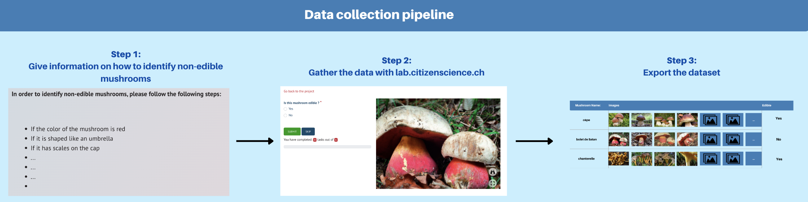
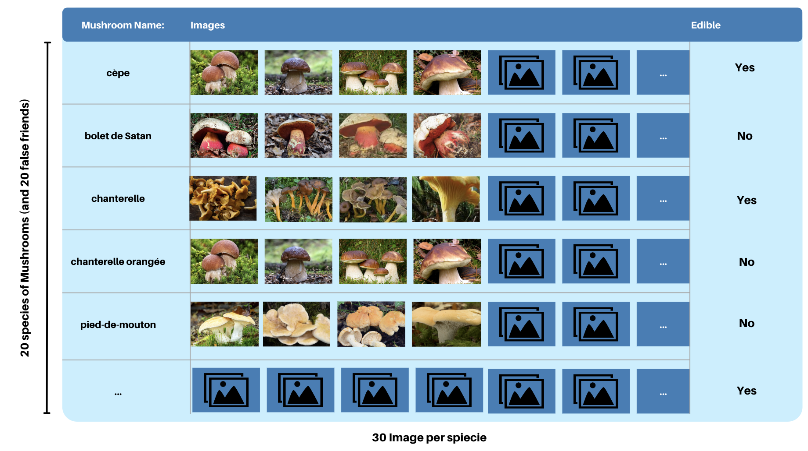
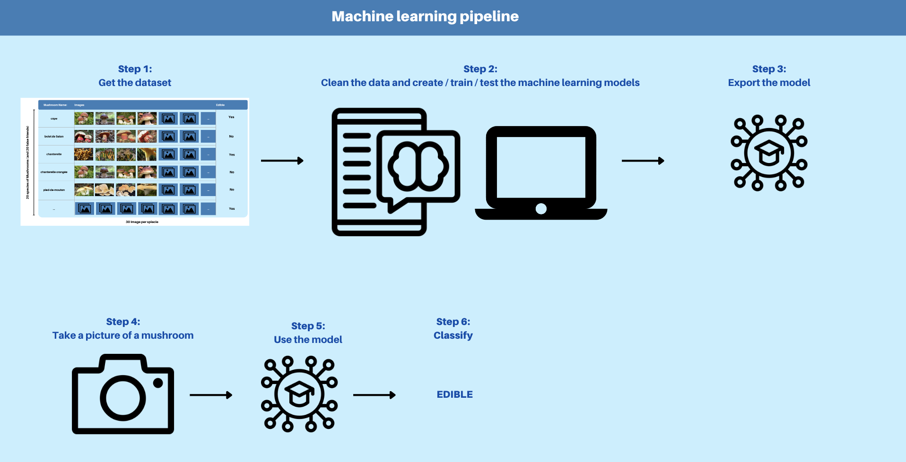

# Table of Contents

1. [My first title](#my-first-title)
2. [My second title](#my-second-title)
## My first title
Some text.
## My second title

# CSAI-project

# Project Name
**Edible Mushroom Classifier**

# Team members
- Alexis Erne
- Muhammad Azeem Arshad
- Maxime Kilian Pasquier

# Brief description explaining the pipeline (CS Component & AI Crowd Component)
The goal is to classify different varieties of edible/non-edible mushrooms from their false friends.

The CS component would involve collecting data from a large number of people that would contribute their knowledge of mushrooms. This data could be collected through the use of an AI crowd platform, Citizenscience, using the CS Builder component. In fact, the participants could help us classify pictures of mushrooms either edible or non-edible. In order to gather a lot of data, we will add information on how to identify non-edible mushrooms. The pipeline that we will use is illustrated in Figure 1 below.

The AI crowd component would be the usage of a machine-learning model that would predict the classification of a mushroom. In fact, we could use AI Crowd in order to create a project that would help us build a classification model for our mushroom dataset. An illustration of the final dataset can be found in Figure 2 below.

# Modeling
This is a supervised learning algorithm on a binary classification problem, edible or non-edible. Finally, the machine learning pipeline is illustrated in Figure 3 below, which also shows how this model could be used once deployed.

## My second title
